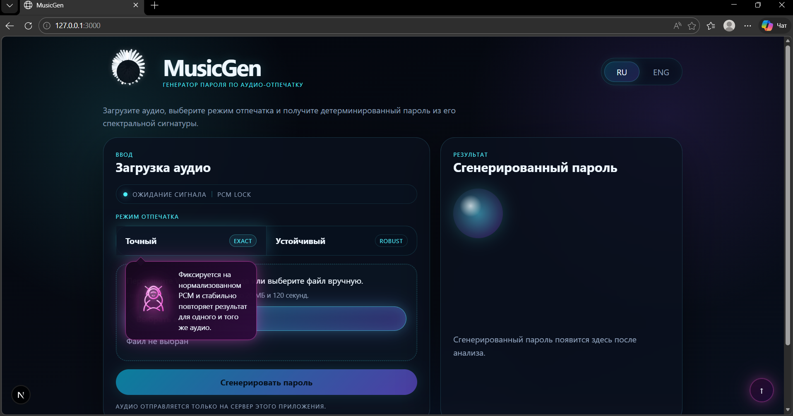
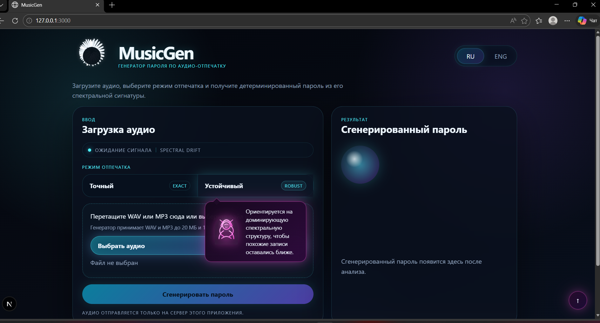
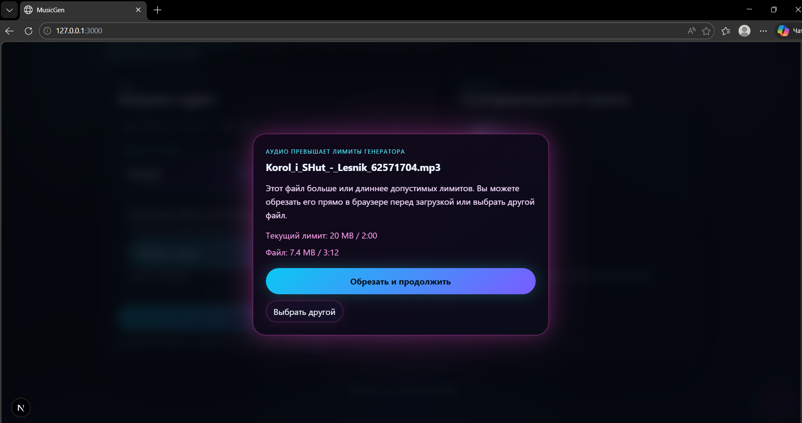
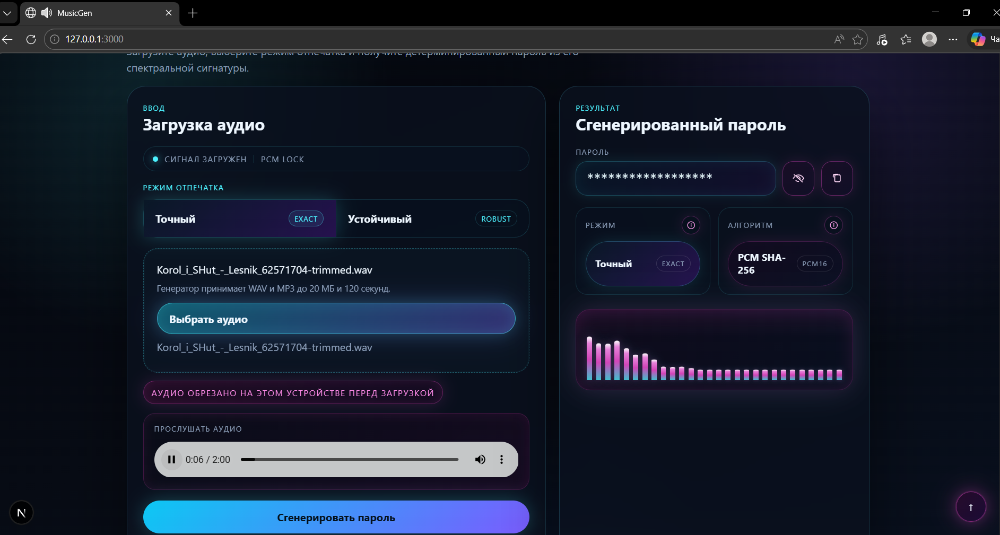
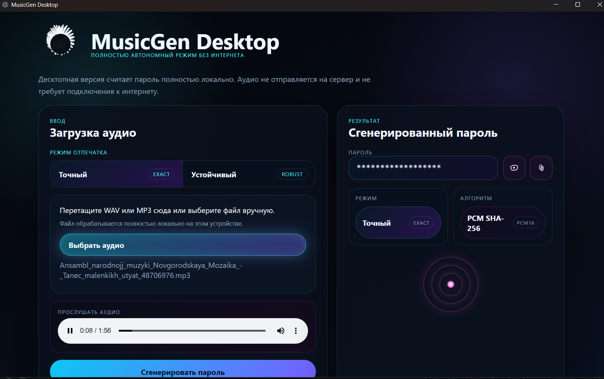

# MusicGen

Не хотите устанавливать менеджер паролей?  
Хранить пароли в блокноте?  
Заморачиваться с шифрованием пароля перед отправкой его в мессенджере другу?

Тогда отправьте другу музыку или любой другой подходящий фрагмент: любимую песню, голосовое сообщение или даже две минуты мяукания вашего кота.

Почувствуйте себя Джеймсом Бондом.  
Сгенерируйте пароль, используя вашу любимую песню.  
Храните свои пароли как плейлист.

MusicGen превращает аудио в детерминированный пароль по его акустическому отпечатку. Один и тот же подходящий аудиофрагмент может дать один и тот же пароль, если использовать одинаковый режим генерации.

## Важно

Этот проект не стоит использовать для по-настоящему критичных вещей: банков, основных почтовых ящиков, криптокошельков, мастер-паролей и другой высокорисковой авторизации.

Причина простая: если кто-то использует тот же самый аудиофрагмент и тот же режим, он может получить тот же самый пароль. MusicGen лучше рассматривать как необычный инструмент, творческий способ обмена паролями или демонстрацию идеи, а не как замену зрелой системе управления секретами.

## Что умеет приложение

- Генерирует пароль из аудио по акустическому отпечатку.
- Поддерживает `WAV` и `MP3`.
- Имеет два режима генерации:
  - `Exact` для максимально повторяемого результата на одном и том же аудио.
  - `Robust` для более устойчивой реакции на похожие версии одной записи.
- Позволяет прослушать загруженное аудио.
- Показывает визуализацию во время воспроизведения.

## Варианты приложения

### Веб-версия

Веб-версия состоит из фронтенда и сервера:

- `frontend/` — интерфейс на `Next.js`, `React`, `TypeScript`
- `backend/` — API и логика анализа аудио на `FastAPI` и `Python`

Подходит, если вы хотите быстро запустить проект локально, посмотреть интерфейс и поэкспериментировать с генерацией паролей из аудио.

### Desktop-версия

В репозитории есть отдельная автономная версия в папке `desktop/`.

Она:

- работает полностью офлайн
- не требует сервера
- не требует интернета
- может быть собрана в `portable`-формат для Windows

Подходит, если хочется запускать MusicGen как отдельное локальное приложение.

## Технологии

- Frontend: `Next.js 15`, `React 19`, `TypeScript`
- Backend: `FastAPI`, `Python`
- Desktop: `Electron`
- Аудио-анализ: нормализация аудио, спектральные признаки, детерминированный маппинг в пароль

## Как запустить

### Веб-версия на Windows

1. Откройте папку проекта.
2. Запустите файл [start_prod.cmd](d:/projects/MusicGen/start_prod.cmd).
3. Откройте в браузере `http://127.0.0.1:3000`

Остановка:

1. Запустите [stop_prod.cmd](d:/projects/MusicGen/stop_prod.cmd)

### Веб-версия на Linux

1. Сделайте скрипты исполняемыми:

```bash
chmod +x start_prod.sh stop_prod.sh scripts/*.sh
```

2. Запустите:

```bash
./start_prod.sh
```

3. Откройте:

```text
http://127.0.0.1:3000
```

Остановка:

```bash
./stop_prod.sh
```

### Desktop-версия

Если desktop-версия уже собрана, запустите portable-файл:

[MusicGen-Portable-0.1.0.exe](d:/projects/MusicGen/desktop/dist/MusicGen-Portable-0.1.0.exe)

Если вы хотите собрать её сами, технические шаги вынесены в отдельную инструкцию:

[TECHNICAL.md](d:/projects/MusicGen/TECHNICAL.md)

## Как работает приложение

1. Вы загружаете аудиофайл.
2. Приложение приводит аудио к более стабильному виду для анализа.
3. Из звука извлекается акустический отпечаток.
4. Этот отпечаток преобразуется в детерминированный пароль.
5. Если использовать тот же файл и тот же режим, результат старается оставаться воспроизводимым.

## Скриншоты

### Главный экран


Главный экран веб-версии с логотипом, переключателем языка и основным описанием приложения.

### Выбор режима и загрузка аудио



Панель загрузки файла, выбор режима отпечатка и подготовка аудио к генерации пароля.

### Окно ограничения по размеру и длительности



Если аудио превышает допустимые лимиты, приложение предлагает обрезать его прямо в браузере или выбрать другой файл.

### Сгенерированный пароль



Блок результата с паролем, режимом генерации, алгоритмом и дополнительными действиями: показать, скрыть и скопировать.

### Визуализация при воспроизведении



Во время прослушивания загруженного файла в панели результата оживает неоновая визуализация в стиле старых аудиоплееров.

### Desktop-версия



Автономная офлайн-версия приложения, которую можно запускать отдельно от веб-части и собирать в portable-формат.

## Для разработчиков

Полная техническая инструкция по структуре проекта, сборке, запуску, Linux-развёртыванию и desktop-сценариям находится здесь:

[TECHNICAL.md](d:/projects/MusicGen/TECHNICAL.md)
